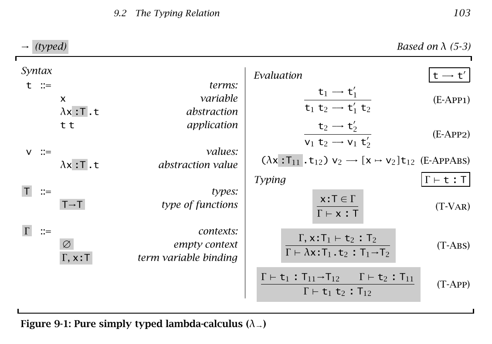

# 9 Simply Typed Lambda-Calculus

https://www.cis.upenn.edu/~bcpierce/tapl/checkers/fullsimple/

hmm ... it seems I missed a lot notes in this chapter

## 9.1 Function Types

type constructor `->` is right associative, that is, the expression `T1 -> T2 -> T3` stands for T1 -> (T2 -> T3)

`(Bool -> Bool) -> (Bool -> Bool)` is the type of functions that take boolean-to boolean functions as argument and return them as results

````
utop # let f (f2: bool -> bool) = f2;;
val f : (bool -> bool) -> bool -> bool = <fun>
````

- NOTE: it's different from `Bool -> Bool -> Bool -> Bool`, which is equivalent to `Bool -> (Bool -> (Bool -> Bool))`
- see https://realworldocaml.org/v1/en/html/variables-and-functions.html

this example is just partial function ...
- [ ] and curry? or decurry?

````
utop # let f b1 b2 b3 = b1 && b2 && b3;;
val f : bool -> bool -> bool -> bool = <fun>    
utop # let f2 = f true;;
val f2 : bool -> bool -> bool = <fun>
utop # let f3 = f2 false;;
val f3 : bool -> bool = <fun>  
utop # f3 true;;
- : bool = false   
````

List.map is a function that accept a function

## 9.2 The Typing Relation

Use explicit typing for now, type inference (reconstruction) is talked in 22

In chap 8 we have things like, no `\Gamma` symbol

````
t1 : Nat
----------
pred t1 : Nat
````

- [ ] TODO: the `\Gamma` symbol is the most confusing

since term `t` may contains nested abstractions, we can just use `t : T`,
and use `\Gamma |- t : T`, where `\Gamma` is a set of assumptions about the types of the free variables in t.

`\Gamma` is called *typing context* or *type environment* is a sequence of variables and their types,
and the `comma` operator extends `\Gamma` by adding a new binding on the right.

The empty context is written as `\emptyset`, but usually it is omitted,
writing `|- t : T` for  "the closed term t has type T under the empty set of assumptions"

- [ ] TODO: what is closed term?

`\Gamma` can thus be thought as a finite function from variables to their types.
`dom(\Gamma)` for the set of variables bound by `\Gamma`

T-ABS

````
\Gamma, x:T1  |- t2 : T2
----------------------------
\Gamma |- \lambda x:T1.t2 : T1 ->  T2
````

T-VAR

`````
x : T \belongs \Gamma
--------------------
\Gamma |- x : T
`````

T-APP

````
\Gamma |- t1 : T11 -> T12   \Gamma |- t2 : T11
-----------------------------------------------
      \Gamma |- t1 t2 : T12
````



## 9.3 Properties of Typing

- inversion lemma
- progress and preservation

## 9.4 The Curry-Howard Correspondence

The `->` type constructor comes with typing rules of two kinds

- introduction rule `T-ABS`, how elements of the type can be *created*
- elimination rule `T-APP`, how elements of type can be *used*

... the relation ship between logic and type systems

## 9.5 Erasure and Typability

- types are only used for checking, converted back to untyped form before been evaluated
- formalized as *erasure*
- evaluation commutes with erasure

more in chap22 for type reconstruction

## 9.6 Curry-Style vs. Church-Style

Curry-style

- define the terms
- define the semantics showing how they behave
- give a type system that rejects some terms whose behaviors we don't like

Church-Style

- define the terms
- identify the well-typed terms
- give semantics just to these

historically, implicitly typed are often given curry style, which church style are common only for explicitly typed systems.
