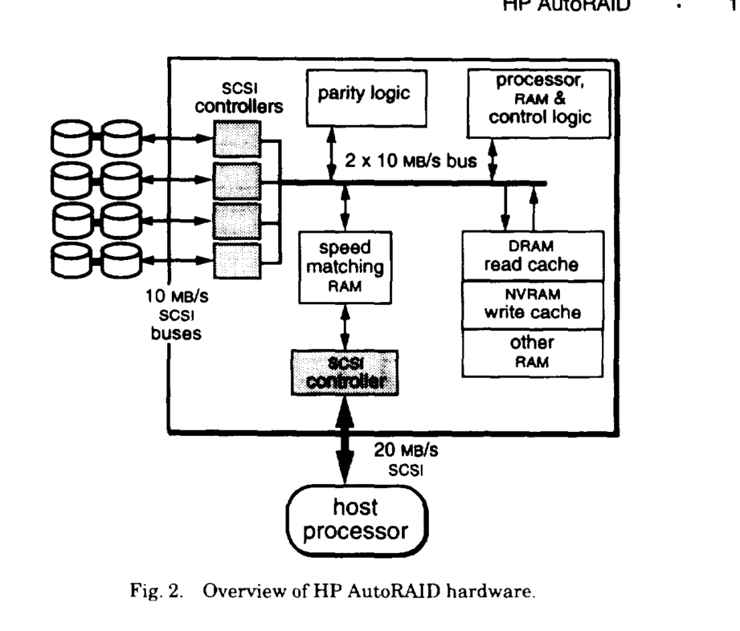

# The HP AutoRAID Hierarchical Storage System

HP Lab 1996 JOHN WILKES, ...

## Related

- [The TickerTAIP Parallel RAID Architecture](tickertaip-parallel-raid.md)

## TODO

- how does it detect access pattern
- it use the dual controller primary backup they blamed in another paper two years ago (脸打的啪啪响)

## Take away

- speed matching buffers

## Abstract

- configure RAID is hard (for system admin)
  - workload
  - hardware detail
- two level storage hierarchy implemented inside a single disk-array controller
  - upper: two copies of active data
  - lower: RAID 5 for code storage
- automatically and transparently manges migration of data blocks between these two levels as access patterns change
- implementation is almost entirely in software

## 1. Introduction

- 'By storing only partial redundancy for the data, the incremental cost of the desired high availability is reduced to as little as 1/N of the total storage-capacity cost (where N is the number of disks in the array)'
- 'Setting up a RAID array is often a daunting task that requires skilled, expensive people and - in too many cases a painful process of trail and error'

Costs of making wrong choice

- perform poorly
- copy all data to migrate
- inadvertent data loss through operator error
- add capacity to an existing array also requires reformat and data reload

Redundant disk

- idle most of the time
- don't know if it really works until shit things really happen

### 1.1 The Solution: A managed Storage Hierarchy

combine mirroring (RAID 1?) and RAID 5, use mirroring for active data (performance),
use RAID5 for inactive data (cost-capacity)

Requirement

- active and inactive
- **active subset must change relatively slowly over time**

Implementation

- Manually, by system administrator
  - error prone
  - can't not adapt rapidly
  - does not allow new resources
- In the file system
  - ideally the best
  - too many FS, not practical
  - [ ] **put it in linux kernel**
- (Chosen) In a smart array controller
  - behind a block level device interface such as SCSI

### 1.2 Summary of the Features of HP AutoRAID

- Mapping: Host block address are internally mapped to their physical locations in a way that allow transparent migration of individual blocks
- Mirroring: Write-active data are mirrored for best performance and to provide single-disk failure redundancy
- RAID 5: Write-inactive data are stored in RAID5 for best cost capacity, **large sequential write go directly to RAID 5**
- Adaption to Changes in the Amount of Data Stored
  - first in mirror
  - the reapportionment is allowed to proceed until the capacity of the mirrored storage has shrunk to about 10% of the total usable space
- Adaption to Workload Changes
- Hot-Pluggable Disks, Fans, Power Supplies, and Controllers
- On-Line Storage Capacity Expansion
- Easy Disk Upgrades
  - disks do not all need to have same capacity
  - the entire array can upgraded by replacing one disk and wait for automatic reconstruction and replace another
- Controller Fail-Over
  - a idle controller in case the primary one failed
  - [ ] But didn't this what they have mentioned in previous paper?
- Active Hot Spare
- Simple Administration and Setup
- Log-Structured RAID 5 Writes
  - small write problem

### 1.3 Related Work

- Iceberg: HA, RAID 6
- Dual controller is inspired by IBM
- log structured file system
- previous hierarchy storage system focus on different media, i.e. tape and disk
- the RAID 1 is not a cache
- [ ] NVM??

## 2. The Technology

### 2.1 Hardware

- [ ] speed matching buffer
- SCSCI for both back-end and front-end

### 2.2 Data Layout

2.2.1 Physical Data layout

- Physical EXtents (PEXes) 1MB
- Physical Extent Group (PEG)
- Segments: 1 PEXes = 128 Segments
  - RAID 5: stripe unit
  - mirror: duplication unit

2.2.2 Logical Data Layout: Relocation Blocks (RBs)

- 64 KB
- size is result of comprise
  - small RB: more mapping and seek
  - large RB: migration cost increase
- Each PEG can hold many RBs

2.2.3 Mapping Structures

- data are held about access times and history, the amount of free space in each PEG (for cleaning an garbage collection purposes)

### 2.3 Normal Operations

Read

Write

- NVM front-end write buffer
- may trigger back-end write based on cache-flushing policy
  - promote RB from RAID 5 to mirrored
  - move data from mirrored to RAID 5 if not enough space in mirrored
  - [ ] TODO: what data do I move? pick randomly?

Back-end RAID 5 writes

- per-RB writes
  - simple
  - slightly worst performance
- batched writes

### 2.4 Background Operations

- garbage collection
- layout balancing

Triggered when the array has been "idle" for a while

- 2.4.1 Compaction: Cleaning and Hole-Plugging
- 2.4.2 Migration: Moving RBs Between Levels
- 2.4.3 Balancing: Adjusting Data Layout Across Drives

### 2.5 Workload Logging

- small overhead

### 2.6 Management Tool

- maintains a set of internal statistics
  - cache utilization
  - I/O times
  - disk utilization
- suggest possible configuration
  - off-line
  - inference-based

## 3. HP AutoRAID Performance Results

Prototyping and even-driven simulation as usual

- [ ] do they reuse stuff they mentioned in last paper? ....
- the memory and disk has increased a lot, 512MB, 2.0GB, I am still using a 256 MB 40GB laptop back in primary school (2003)

### 3.2 Performance Results

Database macrobenchmarks

- OLTP
- 6.7GB (fit into uper level)
- performs within a factor of two  of its optimum when only one-third of the data is held in mirrored storage and about three-fourths of its optimum when two-thirds of the data are mirrored

Microbenchmark

- don't have good explanation for the relatively poor performance of the RAID array in the last two cases

3.2.3 Thrashing

- keep migrating data between mirrored and RAID 5

## 4. Simulation Studies

skipped (reading 60 pages a day is just so .... )

## 5. Summary

> The first product based on the technology, the HP XLR1200 Advanced Disk Array, is now available
