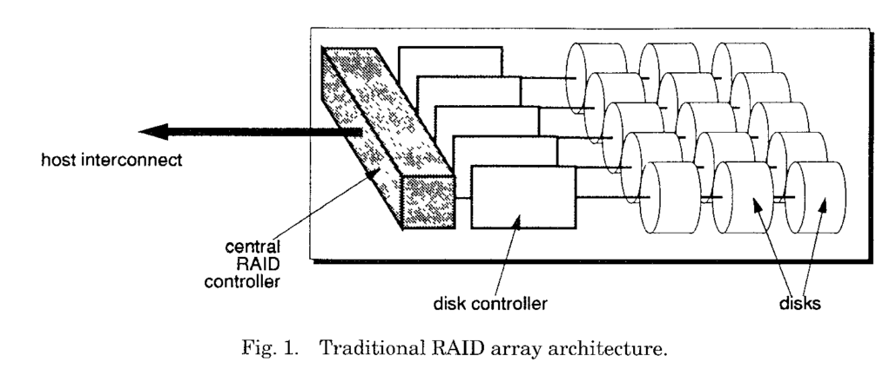

# The TickerTAIP Parallel RAID Architecture

HP Lab 1994

## TODO

- [ ] disk controller
- [ ] disk string??
- [ ] why XOR can be used for RAID parity
- [ ] is file system still aware of the underlying sector, cylinder group when RAID is used?

## Term

- Disk array

> A disk array is a structure that connects several disks together to extend the cost,
power, and space advantages of small disks to higher-capacity configurations. By providing partial
redundancy such as parity, availability can be increased as well.

- RAID parity http://www.pcmag.com/encyclopedia/term/60364/raid-parity

> Parity computations are used in RAID drive arrays for fault tolerance by calculating the data in two drives and storing the results on a third. The parity is computed by XOR'ing a bit from drive 1 with a bit from drive 2 and storing the result on drive 3. After a failed drive is replaced, the RAID controller rebuilds the lost data from the other two drives.

## Abstract

Traditional disk arrays have a centralized architecture, **single controller**

- single point of failure
- limit max number of disks

Distribute the controller functions across several loosely coupled processors

- a family of distributed algorithms for calculating RAID parity
  - [ ] what are distributed algo and RAID parity
- request atomicity
- sequencing
- recovery
- disk-level request-scheduling algorithm inside the array

RAID (Redundant Arrays of Inexpensive Disks) 0, 1, 3, 5

SCSI (Small Computer System Interface)

Existing

- primary backup
  - expensive (backup is only used when primary fails)
- disjoint set of disks
  - [ ] limit the performance available from the array (but why?)

New Architecture

- a cooperating set of array controllers nodes
  - fault tolerance
  - performance scalability
  - smooth incremental growth
  - flexibility

Experiments

- working prototype
- event based simulation

## The TICKERTAIP Architecture

- Originator: host interface
- Worker: connect to disk

assume **parity calcution is a driving factor in determing the performance of a RAID array**

- several originator node connect to different host
- a single host can be connected to multiple originators for higher performance and greator failure resilience

processors are cost-effective engines for calculation parity

- processors are cost-effective engines for calculation parity
- memory bandwidth, rather than processor cycles, is the determining cost factor in providing this functionality
- the cheap commodity microprocessors it uses for the control functions can also be used as the parity calculation engines

## Related Work

- make extensive use of well-known DB techniques such as two-phase commit, partial write ordering
- RADD (Distributed Disks) is for wide area network, while this paper is for everything in one cabin

## Design Issues

RAID 5 as example

- normal mode read
  - skip parity blocks
- normal mode write
  - how to calculate new parity
    - full stripe
    - small stripe
    - large stripe
- where to calculate new parity
  - every node has processor, can put it in non originator nodes
  - at originator
  - solely-parity (use more messages, ignored)
  - at-parity

### Single Failures - Request Atomicity

- primary goal of a regular RAID array is to survive single-disk failures
- But Ticker can survive a fault in *any* single system component

Failures

- Disk
  - same as traditional
- Worker
  - treated just like a disk failure, masked the same way, same recovery algorithm
  - a node is suspected as failed when alive request timeout
  - the node that detect a failure of another node initiates a distributed consensus protocol much like two-phase commit
- Originator (ensure *write atomicity*)
  - read: simply abort
  - write: atomicity
  - add **two phase commit protocol**
  - a temporary originator is selected to complete or abort the request from node already participating in the request

Two phase commit

- early commit: ASAP
- late commit (simpler): delay its commit decision until all that is left to do are the writes
  - simpler to implement
  - lower concurrency and higher request latency
- [ ] TODO: like optimistic and pessimistic locking?

### Multiple Failures - Request Sequences

- introduce coverage for partial controller failures
- *request sequencing* to limit the effects of multiple failures

Requirement

- Previous: defer queuing the data write until the meta-data write has completed
  - limit concurrency
- Now: provide and preserve partial write orderings in the I/O subsystem
- 2 PC provide atomicity but not serializability

Request Sequencing

- use partial ordering both read and write
- use DAG (directed acyclic graphs)
  - node: request
  - edge: dependencies between requests
  - each request has UID
- guarantee
  - no request begins until the request on which it depends complete
  - if a request is aborted, all requests that depend explicitly on it are also aborted
- assign sufficient implicit dependencies to prevent overlapping requests from executing concurrently

Sequencer States

- Not issued
- Unresolved
- Resolved
- InProgress
- Completed
- Aborted
- old request stat has to be GC
- maintain state about aborted requests for a guaranteed minimum time - 10 seconds in prototype

Sequencer Design Alternatives (four, skipped)

### The RAIDmap

- delegate manage of workers' own work to themselves

RAIDmap

- 2d array with an entry for each worker (column) and each stripe
- each worker build its column, filling
  - operation (r/w)
  - layout policy
  - execution policy
- a state table for each block
- computation overlap with other operations to increase performance

### 3.6 Scheduling Disk Accesses

Tried four

- first come first served (FCFS)
- shortest seek time first (SSTF)
- (Best) shortest access time first (SATF)
- batched nearest neighbor (BNN)

### 3.7 Memory Management

- memory management in originator node

## 4. Evaluating

### 4.1 The prototype

13.3k line C

### 4.2 The simulator

### 4.3 Read Performance

### 4.4 Write Performance: An exploration of the Design Alternatives

- large stripe
  - increase throughput
  - increase latency
- at-parity way better than at-originator
  - larger write size
  - lower processor speeds
- commit protocol
  - 2% on throughput
  - 20% on response time

### 4.5 Comparison with a Centralized RAID Array

- CPU is the bottleneck for calculating parity
- scale better (almost perfect linearity)

### 4.6 Synthetic Workloads

## 5. Conclusion

- tolerate any single point of failure
- scalable
- low processor requirement
- scheduling increase performance
- **cost of parity calculation**

Finally, whence the name? Because tickerTAIP is used in all the best pa(rallel)RAIDS (well, I didn't get it)
