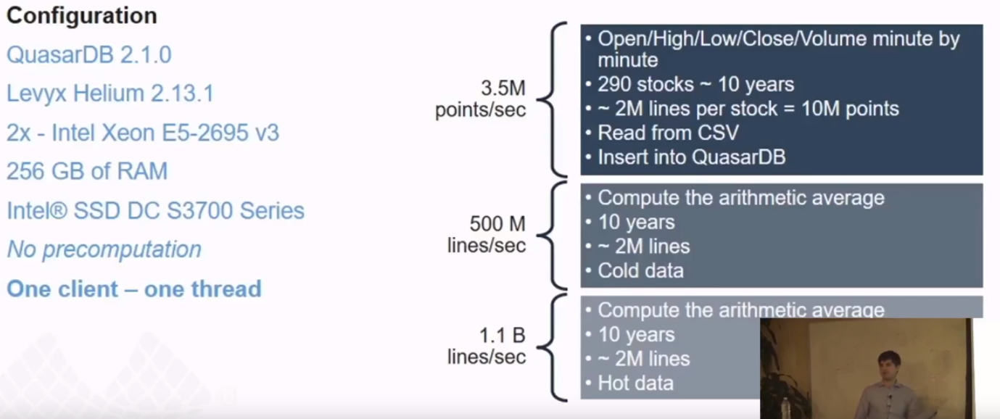

# Time Series Database Lectures from CMU DB - QuasarDB

- issue https://github.com/at15/papers-i-read/issues/84
- video https://www.youtube.com/watch?v=_1IfaDrFvrc
- from http://db.cs.cmu.edu/seminar2017/

## Take away

- they have benchmark using financial data
- **they got only 5 people**
- 'You can always craft the benchmark you need'
- Intel TBB + DPDK

## Notes

benchmark, be critical about db vendors' benchmark results

> You can always craft the benchmark you need

fiance

- large amount
- accurate (consistency?)

their more (fiance) specific benchmark

- direct network card access (DPDK?)
- Chord clustering (the chord I read in CMPS 232?)
- master slave for sync
- async IO
- you know better than PL and OS, which is rarely the case

scale up

- false sharing?
- reference counted objects, they use raw pointer

Solutions

- use intel TBB
- DPDK
- it can use RocksDB on normal file system
- but can also write directly on raw device
- some body mentioned http://www.spdk.io/
- **they got only 5 people**
