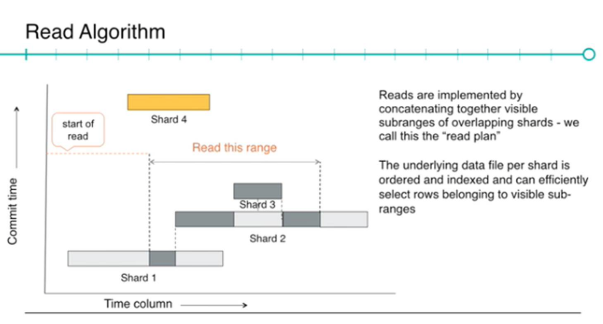
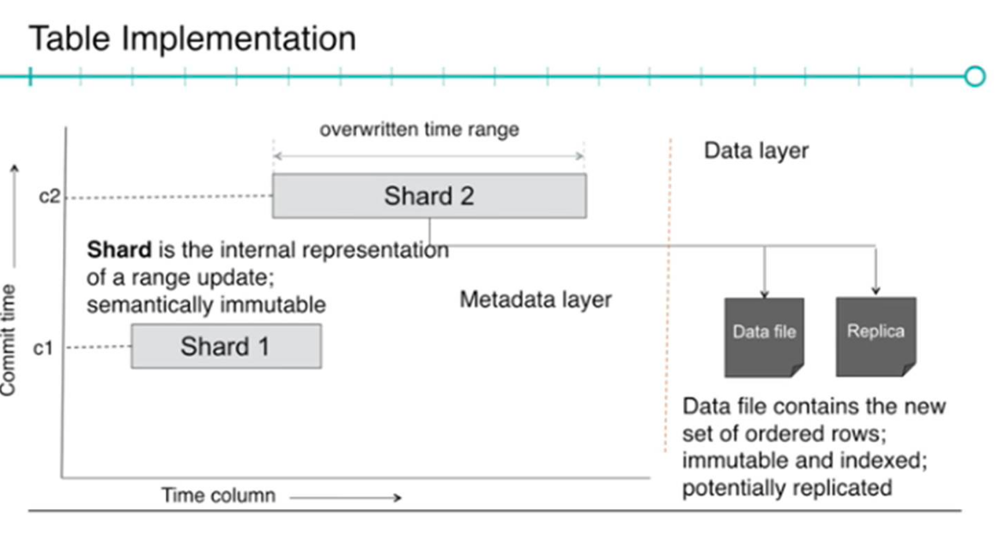

# Time Series Database Lectures from CMU DB - Smooth Storage Two Sigma

- issue https://github.com/at15/papers-i-read/issues/78
- video https://www.youtube.com/watch?v=2wJByeBraIo
- from http://db.cs.cmu.edu/seminar2017/

## Take away

- offline, immutable, log structured merge

## Notes

As a trading firm, it's for sure they use some sort of tsdb

- only support range update
- it's for off line, care throughput over latency
- mainly used for research for stock market predict modeling
- write is atomic, there is a strictly monotonically increasing logical commit timestamp

````
s = write(tbl, [10, 42));
s.addRow(<10, ...>);
s.addRow(<15, ...>);
s.addRow(<15. ...>);
~~s.addRow(<10, ..>)~~ // rows must be added in non-decreasing order
~~s.addRow(<50, ...>)~~ // rows must lie within the given time trange
s.commit()
`````

- read is snapshot read
- ? use SQL Server for metadata ?
- LSM Tree optimized for bulk deletes
- extra level indirection to decouple the table semantics from actual physical data
- each shard (is meta data) point to the data file
  - semantically immutable
  - compaction, small shards to big new shards
- data file
  - static simple two level b-tree
  - 100 MB
  - HDFS




