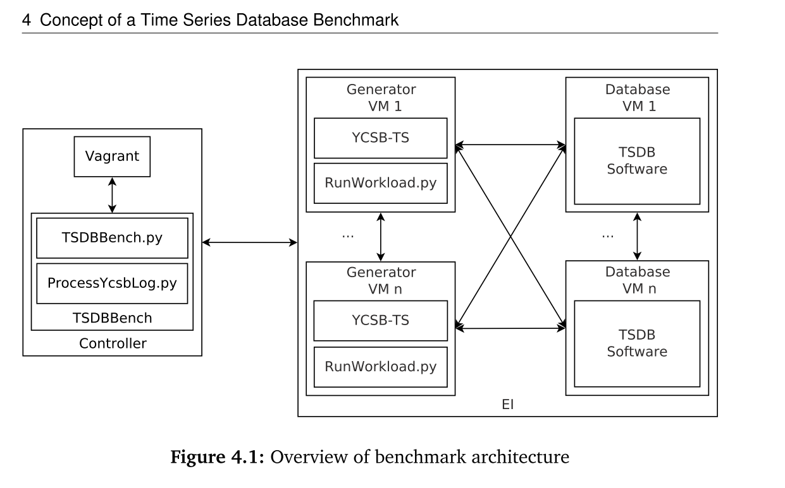

# Comparison of Time Series Databases

- issue https://github.com/at15/papers-i-read/issues/100

- Chapter 2 Existing benchmark for TSDB
- Chapter 3 Existing TSDB and how they are found
- Chapter 4 TSDBBench and YCSB-TS
- Chapter 5 10 TSDB
- Chapter 6 Recommended TSDB based on use case
- Chapter 7 Conclusion and future work

## Take away

- benchmark metrics, YCSB-TS query latency and space consumption
  - we can also add host metrics, disk write amplification etc.
- test mode, run without querying TSDB, the latency of benchmark itself and what the best result could be (baseline)

## Abstract

- 75 TSDB, 42 open source
- compared 10 TSDB with 19 criteria
- TSDBBench https://github.com/TSDBBench
- YCSB-TS https://github.com/TSDBBench/YCSB-TS

## Introduction

- sensor data
- **TSDB is not accurate**
- 42 open source 33 commercial, 75 in total (paper is written in 2016)
- inner and outer
  - inner, calculation support in TSDB and its own storage
  - outer, cluster, HA
- queries and storage
- long term support
- development (community?)

> Scientific comparisons or benchmark-results of TSDBs are rarely found or,
if existing, made for a specific purpose (e.g., showing that a new TSDB is better
than a few others)

- nine different queries
  - insert INS
  - update UPDATE
  - read READ, read smallest unit (i.e. a single point)
  - scanning SCAN
    - [x] read by time range
  - counting CNT (in time range)
  - min and max MIN and MAX (in time range)
- data model, metric, tag, ts, value etc.
- tag is used to group

## 2. Background and Related Work

### 2.1 Preliminary Findings

- pg, MongoDB, OpenTSDB, [aerospike](https://github.com/aerospike/aerospike-server)
- 'Scalability and Robustness of Time-Series Databases for Cloud-Native Monitoring of Industrial Processes'
  - compared OpenTSDB, KairosDB, Databus from linkedin https://github.com/linkedin/databus
  - KairosDB is the best (e ...)
- 'The Next Generation Operational Data Historian for IoT Based on Informix' IBM China
  - SQL and TS (timescale :))
  - footnote said the benchmark IoT-x will be opensourced, but where ?...
- 'In Search of Agile Time Series Database' (read it before!)
  - https://www.gitbook.com/book/taowen/tsdb/details
  - https://github.com/taowen 作者现在在滴滴 (zhihu上也老看见....)
  - old RRDtool, Graphite
  - fast kv (?) OpenTSDB, KairosDB (column family is more precious)
  - SIMD VectorWise, Alenka

### 2.2 Benchmarks

- preloaded data and a set of queries (preloaded data is not hard requirement)
- STAC-M3, commercial, 2 DB
- FinTime https://cs.nyu.edu/shasha/fintime.html, code and result link broken
- YCSB
- TPC
- Benchw 11 years ...
- APB-1 ... 1998 ... (amazing the website is still there) http://www.olapcouncil.org/research/bmarkly.htm
  - two of the members are bough by Oracle (Hyperion and Sun) http://www.olapcouncil.org/member/meminfoly.htm

### 2.3 Data

- mainly generate data, can use existing dataset (but there are not many, i.e. too small UCR (this is for machine learning?))

## 3. Time Series Databases

### 3.1 Definition, Search, and Grouping

- ts, value, tags (optional)
- metric (series) contains multiple points
- range query (on time)

Search

- google 'time series database', `tsdb`
- acm digital library
- ieee xplore
- wikipedia

Group

- require NoSQL
- no requirement
- RDBMS
- Propritary

### 3.2 Group 1: TSDBs with a requirement on NoSQL DBMS

(most of them should be cassandra ...)

- Blueflood (C*)
- KairosDB
- NewTS
- OpenTSDB
- Rhombus https://github.com/Pardot/Rhombus (dead, latest update 2014)

### 3.3 Group 2: TSDBs with no Requirement on any DBMS

- Druid, meta storage + distributed fs
  - real-time + historical node
- InfluxDB
- MonetDB

### 3.4 Group 3: RDBMS

- can't use ts as primary key due to tag
  - add auto incr pk
- MySQL, PostgreSQL

### 3.5 Group 4: Proprietary

- Acunu (bought by apple)
- Aerospike (it is open source now https://github.com/aerospike/aerospike-server)
- Axibase (guess it is using HBase)
- Cityzen Data (?)
- DataStax Enterprise
- Databus (use Oracle)

### 3.6 Feature Comparison of TSDBs

- HA, LB
- built in function
- granularity
  - roll up? (down sampling)
- interfaces
- support and license
- Druid, InfluxDB, MonetDB are Recommended for different requirements

## 4. Concept of a Time Series Database Benchmark

### 4.1 Metrics

YCSB-TS

- query latency
- space consumption
  - [ ] NOTE: we can also consider latency, host cpu usage, write amplification etc.

Latency

- error query are ignored
  - [ ] NOTE: they should be considered, i.e. timeout
- min, max, avg, 95th percentage, 99th percentage in microseconds
  - 95th percentage is the latency below or equal 95th percent of the latencies of all queries in a set of queries are

Space consumption

- hard to measure
  - internal cache
  - data is only transfered to other nodes after certain amount of time
- use df

Good metrics 6 characteristics

- 6 characteristics of a good performance metric: linearity, reliability, repeatability, easiness of measurement, consistency, and independence

### 4.2 Scenarios

- energy related setup, sensor data w/ area, building and room etc.
  - NOTE: hmm, pretty like BtrDB, because their group is doing smart building https://github.com/SoftwareDefinedBuildings
- one, two and five nodes

Data

- 1,000,000 rows pre loaded (for non INS) into one metric
  - [x] tag distribution? or just one single time series?
- ts in milliseconds
  - range 12 days
  - in step of 1 second
    - [ ] even distance?
- value floating-point from 0 to 10,000
  - [ ] no negative number and integer?
- 1,000 tags
  - [x] key ? on the table it's TAG0, TAG1 .... see Table 4.3
  - value 10 characters alphanumeric string
  - each point has 3 tags chosen from a uniform distribution

Ingestion

- load in single row (to simulate sensor)
- NO batch insert

Query

- SCAN, AVG, SUM, CNT, MIN, and MAX

Phases

- load phase, INS
- run phase
  - READ (a timestamp)
    - don't use tag
  - SCAN, AVG, SUM and CNT
    - time range + tags
      - range picked from 1 - 10s
      - 1-5 tags, can have empty match

The workload can be changed, see section 4.6

### 4.3  Requirements on the Benchmark

- it is not expected that results between different environments are comparable
  - [ ] though in real world, it might be what people want to compare, i.e. certain database are locked down to cloud service providers
- additional node for workload generation
- **automated deployment and provisioning of the nodes is required**
  - deploy a vm
  - provision a database
- full pipeline, run, collect data, visualize

### 4.4 (4) Components

#### 4.4.1 An Application for Measurement and Execution of Workloads

- inner part (~~as mentioned before~~ that inner was for TSDB ...)
- executes workloads and measures query latencies
- **alterable part in workload**
  - no. of queries in each phase
  - distribution of different queries (like YCSB, 20% read 80% write etc.)
  - pre-defined tag or on the fly
  - tags per row
  - range of time
    - [ ] for scan etc.?
  - increasing or randomized ts
    - [ ] random interval? (if ts is pure random, some tsdb would just reject the data....)
  - distribution of randomization values
  - amount of rows per timestamp
    - [ ] by controlling tags?
- execute etc.
- chose YCSB

#### 4.4.2 An EI Platform that runs multiple VMs

- [ ] EI means Elastic Infrastructure?
- use Vagrant on AWS and Azure
  - GCP is expensive ...
- https://github.com/hashicorp/vagrant/wiki/Available-Vagrant-Plugins does have AWS plugin but is not longer maintained since 2016
- also support vSphere and OpenStack

#### 4.4.3 An Application to deploy and provision VMs on an EI

- Vagrant
  - Docker, and IaaS API were considered
  - Chef, Puppet (didn't mention Ansible) would only create burden

#### 4.4.4 An Application that starts a Measurement, waits for its Termination, and collects and process the Results afterward

Controller TSDBBench

- deploy and provision Vagrant VM
- run a chosen workload w/ YCSB-TS
- fetch result after benchmark
- repeat (optional)
- combine (optional)
- generate plot and tables (optional)
- make sure no error ...
  - [ ] so what would happen if any step has error? retry?
- http://www.fabfile.org/ to execute ssh

### 4.5 Architecture

reminds me of Xephon-B .... https://github.com/xephonhq/xephon-b

- https://github.com/TSDBBench/Overlord written in python2
  - TSDBBench.py
  - ProcessYcsbLog.py
  - RunWorkload.py

Provision

- full install including os
- (Picked) deriving from a base image that contains the operating system
- create an image for every TSDB
- two types of vm
  - generator
  - tsdb

http://bpmn.io/ BPMN ...(never heard of this graph before)

Collect

- compress ycsb data
- scp

... detailed steps are skipped

### 4.6 Benchmark

- ts float64 Unix timestamp in milliseconds
- value float64
- tags alphanumeric
  - can pre-generate in order to hit when query w/ tags
- added clients for Blueflood, Druid, InfluxDB, KairosDB, NewTS, OpenTSDB and Rhombus

> in test mode, the workload is executed the same way as without test mode, but every TSDB interaction (e.g. connection, querying) is not performed. This test mode helps to see what negative performance effects are introduced due to use of YCSB-TS and what would be the lowest latency possible

- Table 4.x updates to YCSB

### 4.7 Peculiarities

special requirements for some TSDB

#### 4.7.1 Group 1: TSDBs with a Requirement on NoSQL DBMS

- Blueflood does not support tags, SUM, and freely chosen granularities
- KairosDB has two backends H2 and Cassandra
- NewTS can't filter for tag values and timestamp or time range together
- OpenTSDB requires 1 ms time range for READ (same as KairosDB)

### 4.7.2 Group 2: TSDBs with no Requirement on any DBMS

- Druid, drop value outside of time window, so shifted to actual time
- InfluxDB
- MonetDB

### 4.7.3 Group 3: RDBMS

- single node

## 5 Measurements and Results

- RF Replication factor

### 5.1 Scenario 1: 1,000 READ Queries

#### 5.1.1 N=1 RF=1

- INS
  - Best: OpenTSDB 0.210 avg, <1ms 99th
  - Worst InfluxDB, MonetDB, KairosDB w/ H2
- READ
  - Best: Blueflood, NewTS, Rhombus
  - Worst: KairosDB w/ H2 and Cassandra
- space
  - Best: Druid 63.4 MB ... so small
  - Worst: Rhombus, KairosDB H2

#### 5.1.2 N=5 RF=1

- INS
  - non have benefits from additional 4 nodes ...
- Query
  - same
  - and KairosDB is the worst ....
- Space
  - no change

#### 5.1.3 N=5 RF=2

- Space
  - Druid didn't doubled ... hmm (has three explanation ...)
  - others doubled

#### 5.1.4 N=5 RF=5

- Space
  - similar to RF=2, Druid is still e...

...

## Appendix

### A.1 List of TSDBs

skip

### A.5 Hardware and VM Settings

- vSphere w.
- 3 x Supermicro SuperServer SYS-6027R-TRF ... (such a long name)
  - 6x E5-2640 25. GHZ
  - 192 GB RAM 24 x 8 ECC
- storage
  - 2 x 120GB Intel 520 SSD
  - 22 x 1TB 7200 RPM

TSDB VM

- 8 cores
- 16GB RAM
- 50 GB HDD

## List of Abbreviations

- EI elastic Infrastructure
